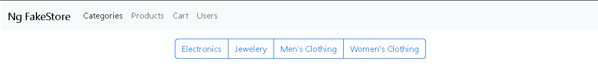
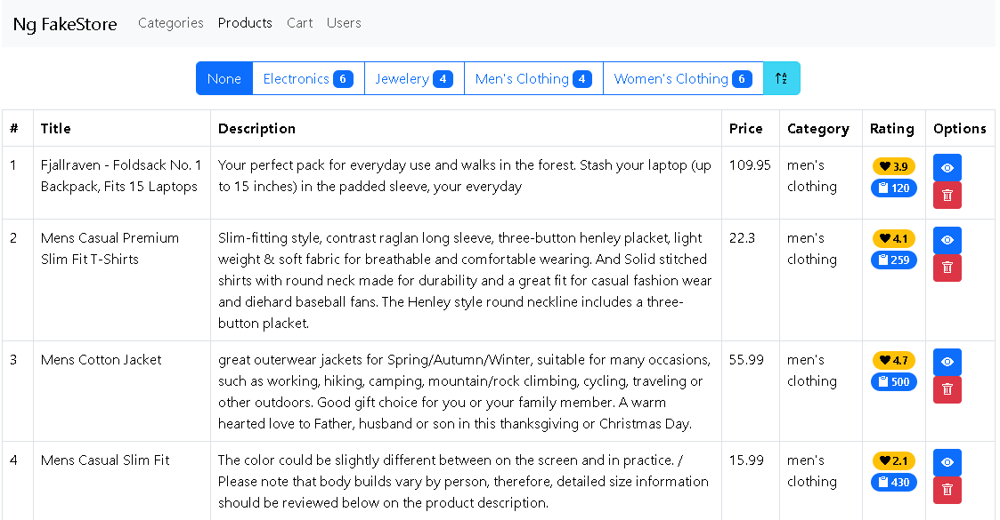
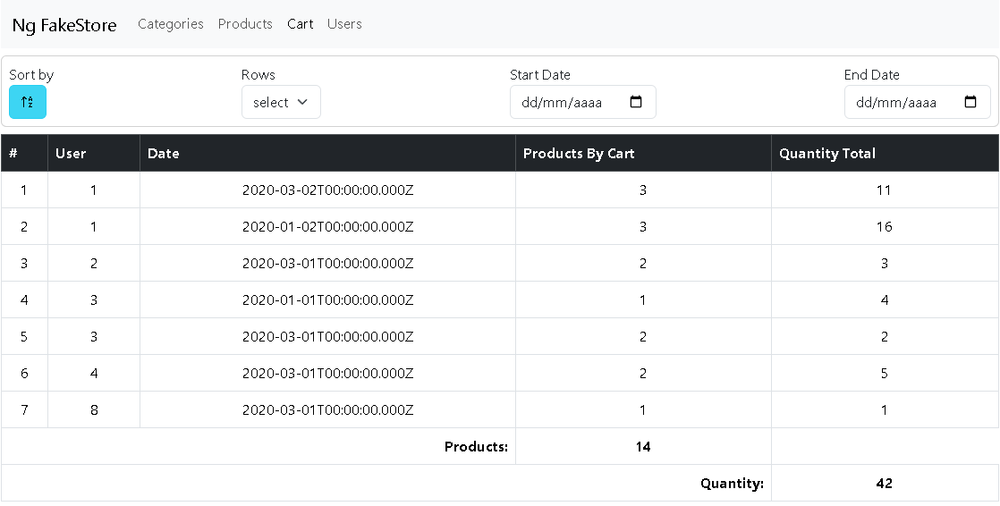
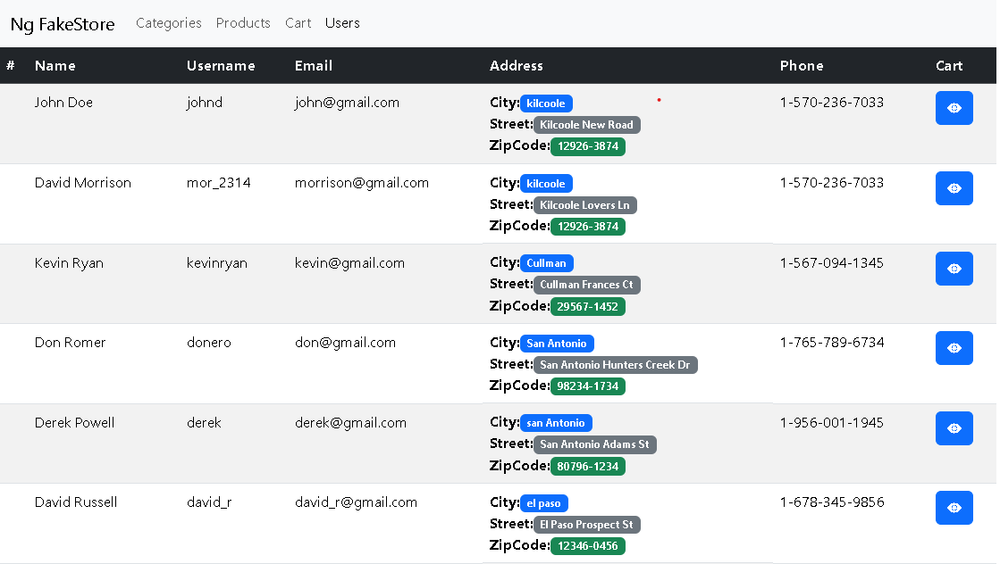

# NgFakeStore App

## App Content:  
Endpoints consumed: 
1. Category
2. Products
3. Cart
4. User   
  
- **Category Page**   
     Show all the categories in btn group

- **Product Page**  
Displays categories in a “button group,” including the number of products for each category in a badge and a rating button. The table shows the products of the selected category; These can be sorted in ascending or descending order by product ID. In Each Product the information can be displayed in a modal and can be deleted; when deleting it shows a modal to confirm the action and then when the product is deleted it shows a toast message.

- **Cart Page**   
Carts can be sorted, limit the number of rows and search by date range.

- **User Page**:  
For each user, display the cart list in a modal.

## Stack 
- Bootstrap 5.3(`https://getbootstrap.com`)
- Bootstrap Icons 1.11(`https://icons.getbootstrap.com`)
- Angular v17 with modules (--standalone false)
- FakeStore API (`https://fakestoreapi.com`)

## Run the project
- Run `npm install` to install all dependencies
- Run `ng serve` to start de project or `ng serve -o` to open it in the default browser. Also `ng serve --port=portNumber` can be used to open it in a specific port.
- Navitate to `http://localhost:4200/`

